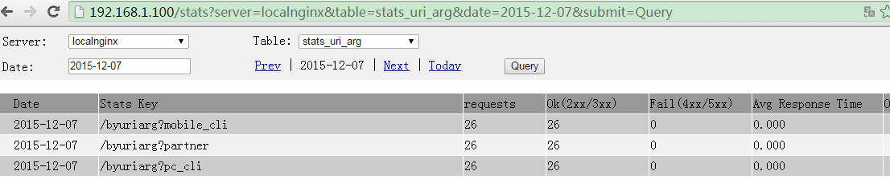

Name
====

lua-resty-stats - is a statistical module for nginx base on ngx_lua, Statistical key and values are configurable, can use the nginx core's variables and this module's variables. The statistical result store in mongodb.

Table of Contents
=================

* [Name](#name)
* [Synopsis](#synopsis)
* [Variables](#variables)
* [Methods](#methods)
    * [add_def_stats](#add_def_stats)
    * [add_stats_config](#add_stats_config)
    * [init](#init)
    * [log](#log)
* [Simple Query] (#simple-query)
* [Simple Demo] (#simple-demo)
* [Authors](#authors)
* [Copyright and License](#copyright-and-license)

Synopsis
========
```nginx
    #set ngx_lua's environment variable:
    lua_package_path '/path/to/lua-resty-stats/lib/?.lua;/path/to/lua-resty-stats/lib/?/init.lua;/path/to/lua-resty-stats/view/?.lua;;';
    # init the lua-resty-stats
    init_worker_by_lua '
        local stats = require("resty.stats")
        -- add the default stats that named "stats_host"
        stats.add_def_stats()
        -- the general stats"s config
        local update = {["$inc"]= {count=1, ["hour_cnt.$hour"]=1, ["status.$status"]=1, 
                      ["req_time.all"]="$request_time", ["req_time.$hour"]="$request_time"}}
        
        -- stats by uri
        stats.add_stats_config("stats_uri", 
            {selector={date="$date",key="$uri"}, update=update,
             indexes={{keys={'date', 'key'}, options={unique=true}},{keys={'key'}, options={}}} })
            
        -- stats by arg        
        stats.add_stats_config("stats_arg", 
            {selector={date="$date",key="$arg_client_type"}, update=update,
             indexes={{keys={'date', 'key'}, options={unique=true}},{keys={'key'}, options={}}} })

        -- stats by uri and args 
        stats.add_stats_config("stats_uri_arg", 
            {selector={date="$date",key="$uri?$arg_from"}, update=update,
             indexes={{keys={'date', 'key'}, options={unique=true}},{keys={'key'}, options={}}} })

        -- stats by http request header
        stats.add_stats_config("stats_header_in", 
            {selector={date="$date",key="city:$http_city"}, update=update,
             indexes={{keys={'date', 'key'}, options={unique=true}},{keys={'key'}, options={}}} })
        
        -- stats by http response header
        stats.add_stats_config("stats_header_out", 
            {selector={date="$date",key="cache:$sent_http_cache"}, update=update,
             indexes={{keys={'date', 'key'}, options={unique=true}},{keys={'key'}, options={}}} })

        local mongo_cfg = {host="192.168.1.201", port=27017, dbname="ngx_stats"}
        local flush_interval = 2 -- second
        local retry_interval = 0.2 -- second
        -- init stats and start flush timer.
        stats.init(mongo_cfg, flush_interval, retry_interval)
    ';
    server {
        listen       80;
        server_name  localhost;

        location /byuri {            
            echo "byuri: $uri";
            log_by_lua '
                local stats = require("resty.stats")
                stats.log("stats_uri")
                stats.log("stats_host")
            ';
        }

        location /byarg {
            echo_sleep 0.005;    
            echo "login $args";
            log_by_lua '
                local stats = require("resty.stats")
                stats.log("stats_arg")
            ';
        }

        location /byarg/404 {
            request_stats statby_arg "clitype:$arg_client_type";        
            return 404;
            log_by_lua '
                local stats = require("resty.stats")
                stats.log("stats_arg")
            ';
        }

        location /byuriarg {
            echo "$uri?$args";
            log_by_lua '
                local stats = require("resty.stats")
                stats.log("stats_uri_arg")
            ';
        }

        location /byhttpheaderin {
            echo "city: $http_city";
            log_by_lua '
                local stats = require("resty.stats")
                stats.log("stats_header_in")
            ';
        }

        location /byhttpheaderout/ {
            proxy_pass http://127.0.0.1:82;
            log_by_lua '
                local stats = require("resty.stats")
                stats.log("stats_header_out")
            ';
        }
    }

    server {
        listen       82;
        server_name  localhost;
            location /byhttpheaderout/hit {
            add_header cache hit;
            echo "cache: hit";
        }
        location /byhttpheaderout/miss {
            add_header cache miss;
            echo "cache: miss";
        }
    }

	server {
	    listen 2000;
	    server_name localhost;
	 
	    location /stats {
	        set $template_root /path/to/lua-resty-stats/view;
	        content_by_lua_file '/path/to/lua-resty-stats/view/main.lua';
	    }
	}
```

Variables
=======
* nginx_core module supports variable: http://nginx.org/en/docs/http/ngx_http_core_module.html#variables 
* This module variables 
     * date: current date in the format: 1970-09-28 
     * time: current time in the format: 12:00:00 
     * year: current year 
     * month: current month 
     * day: current date 
     * hour: current hour 
     * minute: current minute 
     * second: current second 

Methods
=======
To load this library,

you need to specify this library's path in ngx_lua's lua_package_path directive. For example:
```nginx
http {
   lua_package_path '/path/to/lua-resty-stats/lib/?.lua;/path/to/lua-resty-stats/lib/?/init.lua;/path/to/lua-resty-stats/view/?.lua;;';
}
```

you use require to load the library into a local Lua variable:
```lua
local stats = require("resty.stats")
```


[Back to TOC](#table-of-contents)
add_def_stats
---
`syntax: stats.add_def_stats()`

add the predefined stats configs that contains:
```lua
stats_name: stats_host
stats_config:
{
    selector={date='$date',key='$host'}, 
    update={['$inc']= {count=1, ['hour_cnt.$hour']=1, ['status.$status']=1, 
            ['req_time.all']="$request_time", ['req_time.$hour']="$request_time"}},
            indexes={
                {keys={'date', 'key'}, options={unique=true}},
                {keys={'key'}, options={}}
            },
    }
}
```
After this method is called, when you used stats.log(stats_name) method, you can use these predefined statistics.

add_stats_config
---
`syntax: stats.add_stats_config(stats_name, stats_config)`

Add a custom statistical configuration item that contains stats_name and stats config.
* `stats_name` is the name of the statistics, and also is the name of the mongodb's table. 
The name will be used when calling the `stats.log(stats_name)` method.
* `stats_config` is used to define the values of statistics. 
 `stats_config` is a table that contains some fileds:
    * `selector` a mongodb query statement. like: `{date="$date",key="$host"}`
    * `update` a mongodb update statement. like: `{["$inc"]= {count=1, ["hour_cnt.$hour"]=1, ["status.$status"]=1, 
                      ["req_time.all"]="$request_time", ["req_time.$hour"]="$request_time"}}`
    * `indexes` a table that contains all fields of the index.
 
The `selector` and `update` configuration can use [variables](#variables).  <br/>
Note that "$inc" is not a nginx variable, it's a mongodb's operator. 

init
---
`syntax: stats.init(mongo_cfg, flush_interval, retry_interval)`

Initialization statistical library.
* `mongo_cfg` The mongodb configuration, contains fields:
    * `host` mongodb's host
    * `port` mongodb's port
    * `dbname` mongodb's database name.
* `flush_interval` flush data to the mongodb time interval, the time unit is seconds.
* `retry_interval` the retry time interval on flush error,the time unit is seconds.


log
---
`syntax: stats.log(stats_name)`

Collect the specified(by stats_name) statistical information at the log phrase.<br/>
* `stats_name`  is one statistical name that add by `stats.add_stats_config`. <br/>
if the `stats_name` is nil, log method will collect all the statistics that have been configured.

[Back to TOC](#table-of-contents)

Simple Query
=======
lua-resty-stats comes with a simple query page, which can be used in the following steps:
* add location configuration to nginx.conf

```nginx
location /stats {
    set $template_root /path/to/lua-resty-stats/view;
    content_by_lua_file '/path/to/lua-resty-stats/view/main.lua';
}
```

* Access query page. eg. `http://192.168.1.xxx/stats`:



Simple Demo
========
[Simple Stats demo](docs/stats_simple_demo.conf "Simple Stats demo")

You can include it in nginx.conf using the include directive. Such as:
`include /path/to/simple_stats.conf;`

Authors
=======

Xiaojie Liu <jie123108@163.com>。

[Back to TOC](#table-of-contents)

Copyright and License
=====================

This module is licensed under the BSD license.

Copyright (C) 2015, by Xiaojie Liu <jie123108@163.com>

All rights reserved.

Redistribution and use in source and binary forms, with or without modification, are permitted provided that the following conditions are met:

* Redistributions of source code must retain the above copyright notice, this list of conditions and the following disclaimer.

* Redistributions in binary form must reproduce the above copyright notice, this list of conditions and the following disclaimer in the documentation and/or other materials provided with the distribution.

THIS SOFTWARE IS PROVIDED BY THE COPYRIGHT HOLDERS AND CONTRIBUTORS "AS IS" AND ANY EXPRESS OR IMPLIED WARRANTIES, INCLUDING, BUT NOT LIMITED TO, THE IMPLIED WARRANTIES OF MERCHANTABILITY AND FITNESS FOR A PARTICULAR PURPOSE ARE DISCLAIMED. IN NO EVENT SHALL THE COPYRIGHT HOLDER OR CONTRIBUTORS BE LIABLE FOR ANY DIRECT, INDIRECT, INCIDENTAL, SPECIAL, EXEMPLARY, OR CONSEQUENTIAL DAMAGES (INCLUDING, BUT NOT LIMITED TO, PROCUREMENT OF SUBSTITUTE GOODS OR SERVICES; LOSS OF USE, DATA, OR PROFITS; OR BUSINESS INTERRUPTION) HOWEVER CAUSED AND ON ANY THEORY OF LIABILITY, WHETHER IN CONTRACT, STRICT LIABILITY, OR TORT (INCLUDING NEGLIGENCE OR OTHERWISE) ARISING IN ANY WAY OUT OF THE USE OF THIS SOFTWARE, EVEN IF ADVISED OF THE POSSIBILITY OF SUCH DAMAGE.

[Back to TOC](#table-of-contents)

